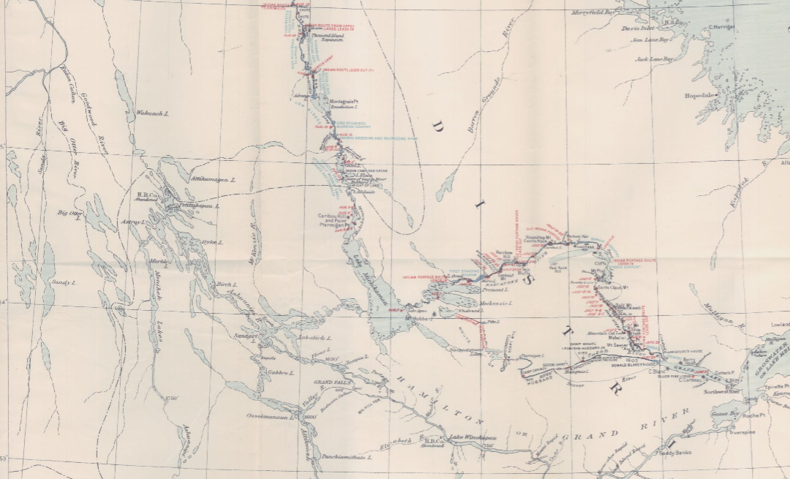

### NRS528 / Geographical Information Systems in Python

> There was danger to be faced and good "copy" to be obtained. And so it was ho for the land of "bared boughs and grieving winds"!

Welcome to my Github repository for NRS528 "Geographical Information Systems in Python." My name is Elliot Vosburgh. I'm in my last semester of the Master of Environmental Science and Management (MESM) program at the University of Rhode Island. My specialization is Remote Sensing and Spatial Analysis.

I began this README file with a quote from Wallace's book, "[The Lure of the Labrador Wild](https://www.gutenberg.org/cache/epub/4019/pg4019-images.html)." Before I started the MESM program, I became interested in exploration. Technology has limited our frontiers to all but the most inaccessible (including those [distant](https://voyager.jpl.nasa.gov/mission/status/), [inhospitable](https://oceanexplorer.noaa.gov/news/oer-updates/2024/million-mounds-news.html), and [microscopic](https://mars.nasa.gov/news/406/scientists-find-evidence-of-ancient-microbial-life-on-mars/)). It is fascinating to read accounts by Champlain, Mackenzie, Cook, and even later publications like that of Hubbard. It is remarkable that not even a century has passed since Amundsen disappeared. My grandparents would have heard of that news as it happened.

The technologies available to us, like GIS and high resolution sensors, are relatively recent inventions. For those of us studying these things in school, we are fortunate to be at their forefront. In a sense, they have allowed us to explore the world from our desks. The explorers of the past required fortitude and determination that is almost impossible for me to imagine. I can only guess that the circumstances they eventually found themselves in overwhelmed any doubts they may have had. In a way, I envy them.

Here we are in the 21st century. Applying Python in GIS is a new frontier for me, despite its vastness not comparing to the hardy scientists of yesteryear. At least if I make mistakes I can simply begin again.
